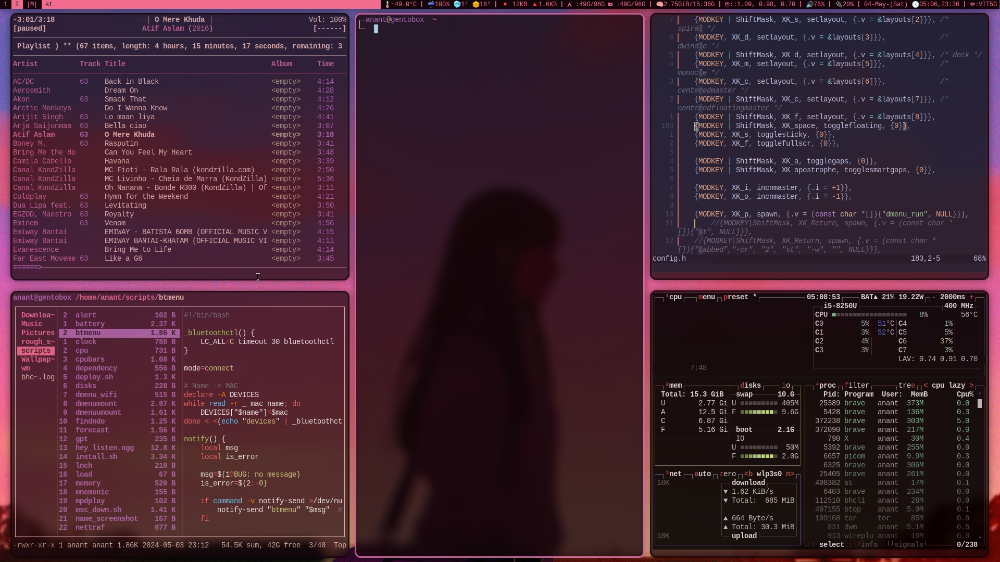
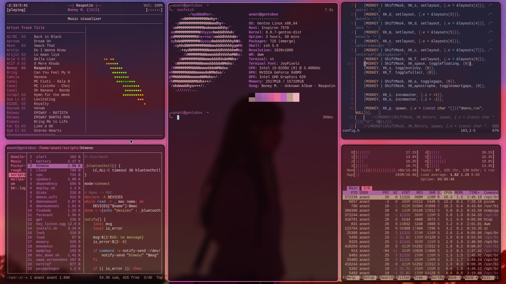
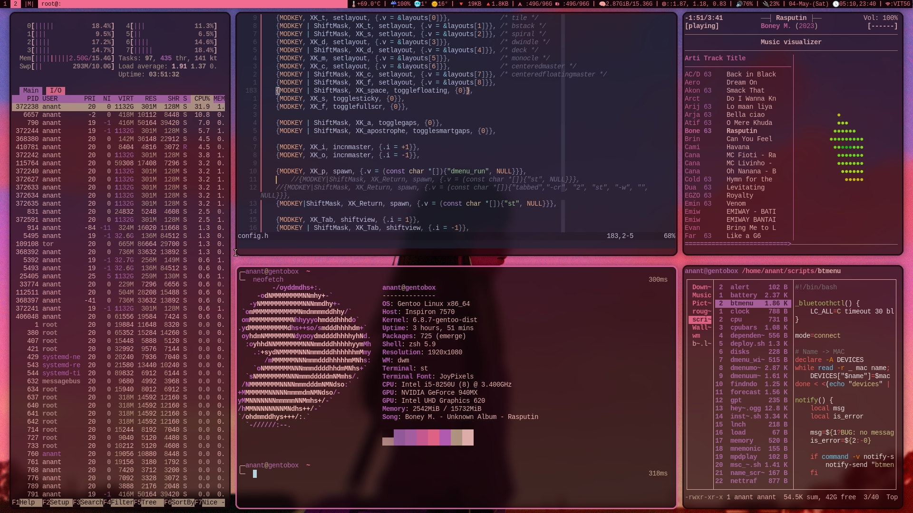
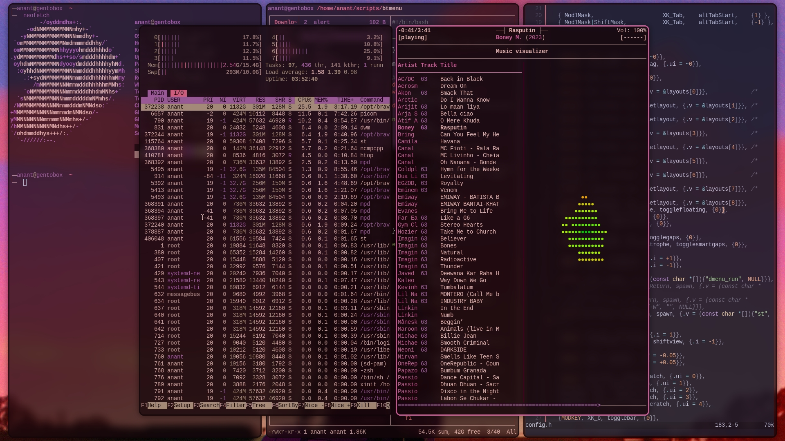
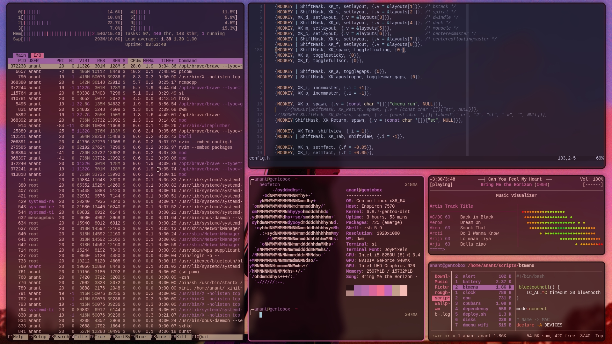
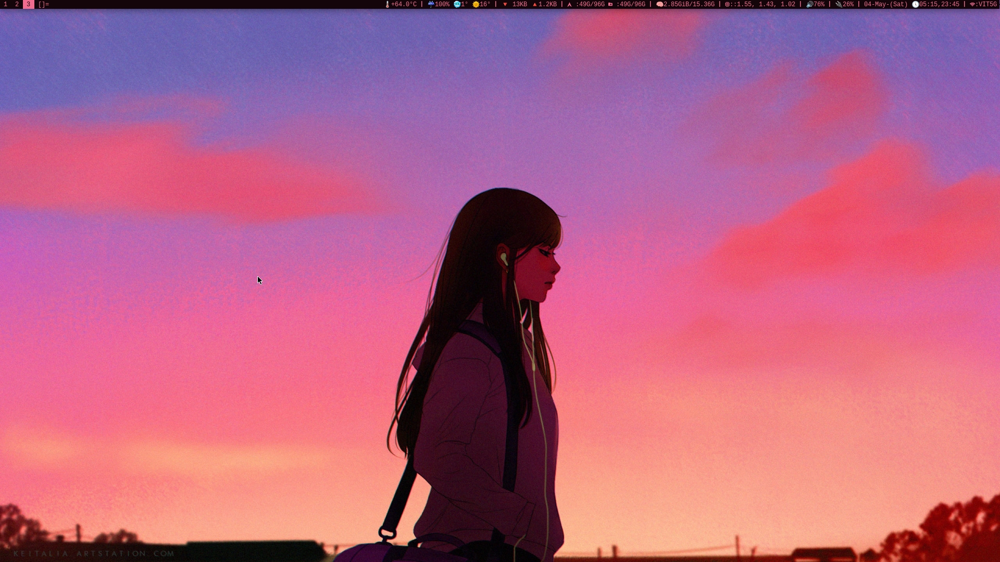
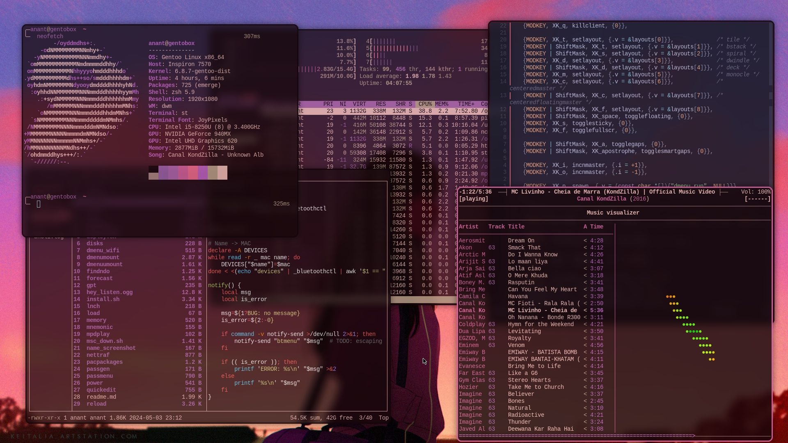
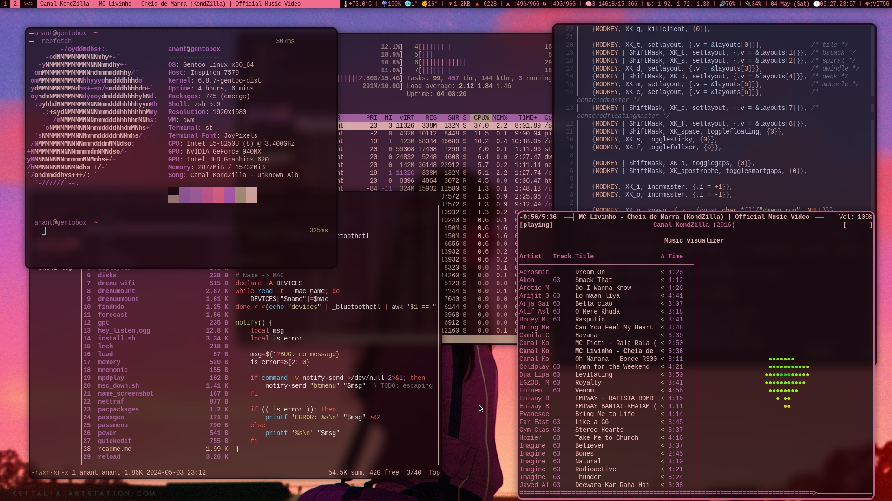

# Strange's Build of DWM ST DMENU & configs


<details>
<summary> Screenshots </summary>

<p align="center">

</p>
<br> <br>

<p align="center">

<br> <br>
</p>

<p align="center">

<br> <br>
</p>

<p align="center">

<br> <br>
</p>

<p align="center">

<br> <br>
</p>

<p align="center">

<br> <br>
</p>

<p align="center">

<br> <br>
</p>

<p align="center">

<br> <br>
</p>

CheckOut more [Screenshots](./img/) :)

</details>

## How to get this shit running ??

```bash
curl https://serve.strangeworld.blog/setup.sh
bash ./setup.sh
```
<details>
<summary> If above link breaks </summary>

The script can be found in my [scripts](https://github.com/AnantStrange/Scripts) repo

</details>


## __Disclaimer__ !!
##### __Do not blindly run shit[scripts..] off random github repos.__
Even if the user/script not be malicious, the script can still can cause damage
to ur system if there are bugs and install weird 3rd party scripts off other
github as part of plugins.

Please take a look at the contents of script before runnign the script and
adjust any parts u dont want :)

Also it is __possible__ to just manually clone each repo and setup everything
without my script and if u are that guy.. well u dont really need this
[readme.md](./readme.md)
;)


## The script - 
Now the setup.sh script should be really easy to read thru, but still - 

- It will git clone my DWM, ST, DMENU, DWMBLOCK, TABBED into ~/wm <br>
- It will also clone my | dotfiles into ~/.dotfiles | Wallpapers into ~/Wallpapers | scripts into ~/scripts [ Add ~/scripts to the __END__ of ur $PATH ]

The next part is optional and does not contribute to wm whatsoever but ratehr to zsh and tmux setup

- It will clone zsh-z (zoxide) plugin in ~/.local/share/zsh | This is where all of my custom/manual zsh plugins and scripts are stored.
- Also add in zsh-autosugestions, zsh-autocomplete, zsh-fast-syntax-highlighting
and finaly tpm - tmux plugin manager. 

- Now it will cd into each dir in ~/wm/* and attempt to sudo make install, At
  the end of scipt it will give what repo compiled succesfully and which failed.
- If something fails, it 99% must be a missing package.

## Launch the shit up finally

If u use `.xinitrc`, it should look something like this - 

```
tree -ifa ~/Wallpaper | grep  "png\|jpg\|jpeg" > /tmp/wallpaper_list &
wal -i "$HOME/Wallpaper/" &&
xrdb -merge "$HOME/.cache/wal/colors.Xresources" &&

dwmblocks>> /tmp/dwmblock_log 2>&1  &
sxhkd >> /tmp/sxhkd_log 2>&1 &
dunst >> /tmp/dunst_log 2>&1 &
picom >> /tmp/picom_log 2>&1 &

exec dwm >> /tmp/dwm_log 2>&1

```
<hr>

#### If u want the colors of wallpaper and ur wm themeto match, You need to install [pywal](https://github.com/dylanaraps/pywal).

- On arch
  ```
  pacman -Sy python-pywal  
  ```

- On debian
  ```
  # if there isnt a package in debian repos
  sudo pip3 install pywal
  ```

### Want to use my dotfiles ? / What do i do with .dotfiles dir ?

I maintain my dotfiles with GNU Stow, which makes it such a breeze.
For details on how to use it -->
[AnantStrange/dotfiles](https://github.com/AnantStrange/dotfiles)


### Want my Wallpapers ?

Head over to
[AnantStrange/Wallpaper](https://github.com/AnantStrange/Wallpapers)


